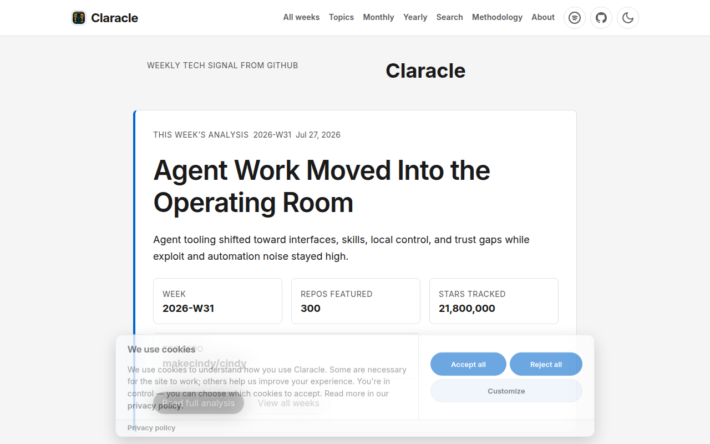
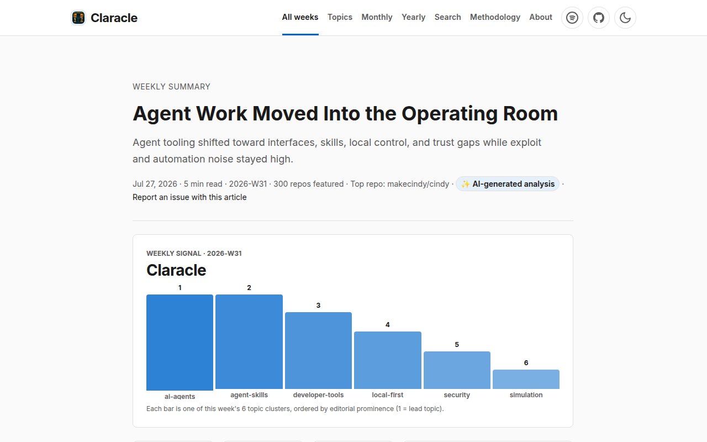
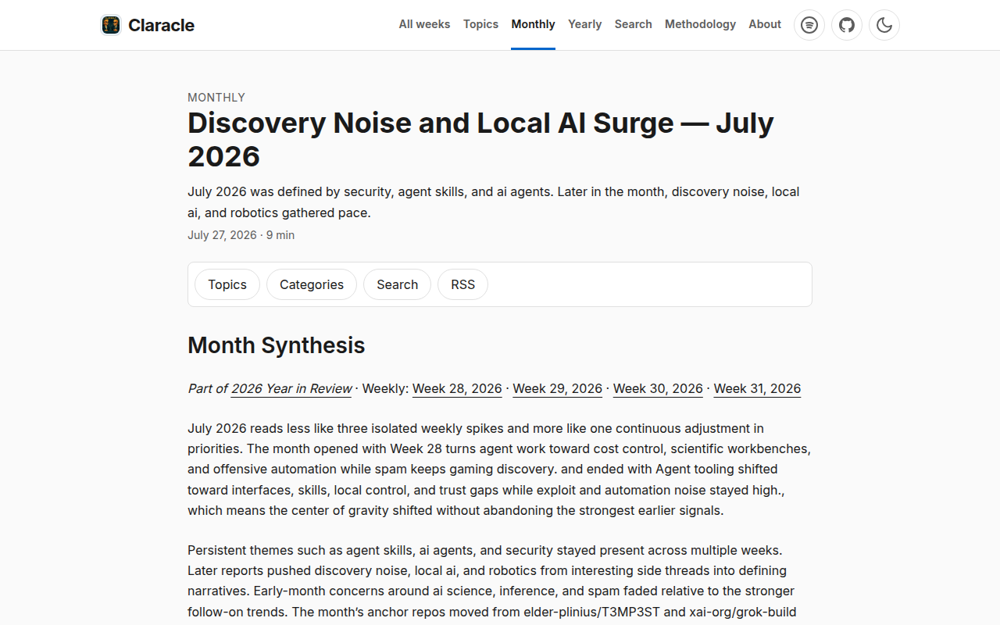
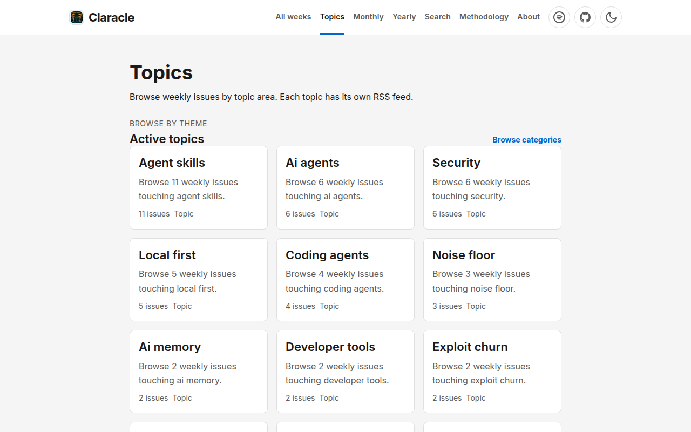

[](https://github.com/jmservera/SquadScope/actions/workflows/crawl-and-publish.yml)
[](https://github.com/jmservera/SquadScope/actions/workflows/deploy-site.yml)

# Claracle (SquadScope)

**Data published weekly at [claracle.com](https://claracle.com/).** Start with the latest public reports:

- [Weekly GitHub trend analysis](https://claracle.com/weekly/2026/w31/) — signal, noise, gaps, and notable repositories from the latest crawl
- [Monthly trend rollups](https://claracle.com/monthly/2026/07/) — multi-week arcs and recurring themes
- [Yearly trend narrative](https://claracle.com/yearly/2026/) — longer-horizon synthesis across published months
- [Topics](https://claracle.com/topics/) and [RSS](https://claracle.com/index.xml) — discovery and subscription surfaces

Claracle is the public brand for SquadScope: an automated AI-powered GitHub trend observatory. It crawls GitHub and selected external sources, separates durable signal from leaderboard noise, and publishes citable weekly, monthly, and yearly analysis as a static Hugo site.

## Why this exists

GitHub creates more repositories and trend spikes than people can evaluate manually. Claracle turns that stream into a discoverable data product for:

- **Builders and founders** tracking where developer attention is moving
- **Researchers and journalists** citing original longitudinal trend observations
- **Developer-relations and open-source teams** watching ecosystem momentum
- **Operators** who need a reproducible, GitHub-native publishing pipeline

The repository contains the crawler, analysis prompts, generated Hugo content, and operating docs. The public reading surface lives at [claracle.com](https://claracle.com/).

## Example published outputs

| Output | Live Claracle page | Source in this repo | What it shows |
| --- | --- | --- | --- |
| Weekly issue | [Agent Work Moved Into the Operating Room](https://claracle.com/weekly/2026/w31/) | [`content/weekly/2026/W31.md`](content/weekly/2026/W31.md) | Weekly signal/noise analysis, notable projects, press context, and blind spots |
| Monthly rollup | [Discovery Noise and Local AI Surge — July 2026](https://claracle.com/monthly/2026/07/) | [`content/monthly/2026/07.md`](content/monthly/2026/07.md) | Cross-week trend arcs, persistent themes, accelerating themes, and top repos |
| Yearly narrative | [When Agents Became Infrastructure — 2026 So Far](https://claracle.com/yearly/2026/) | [`content/yearly/2026.md`](content/yearly/2026.md) | Longer-horizon interpretation of recurring patterns across months |
| Methodology | [How Claracle reads GitHub trends](https://claracle.com/methodology/) | [`content/methodology/_index.md`](content/methodology/_index.md) | Editorial method for separating signal from spam, hype, and manipulated discovery |
| Raw crawl artifact | n/a | [`data/raw/2026-W31.json`](data/raw/2026-W31.json) | GitHub repositories, topics, stars, and metadata captured for the weekly analysis |
| AI analysis artifact | n/a | [`data/analyzed/2026-W31-summary.md`](data/analyzed/2026-W31-summary.md) | The generated analysis used to produce the published weekly article |

## Screenshots and visual status

The README now embeds real refreshed captures from a local Hugo build of the Claracle site.









## Architecture

Claracle uses a GitHub-native, static-site pipeline. The weekly crawler remains the source of truth; downstream pages and discovery surfaces are generated from stored artifacts rather than re-crawling on demand.

```mermaid
flowchart LR
    GH[GitHub API] --> Crawl["Crawl<br/>scripts/crawl.py"]
    News[External RSS/news] --> Crawl
    Crawl --> Raw[data/raw JSON]
    Crawl --> Snapshots[data/snapshots stars]
    Raw --> Synthesis["Weekly Synthesis<br/>Copilot CLI agent"]
    Snapshots --> Synthesis
    Synthesis --> Analysis["Weekly Analysis<br/>Copilot CLI agent"]
    Analysis --> Analyzed[data/analyzed Markdown + JSON]
    Analyzed --> Generate["Generate Hugo content<br/>scripts/generate_content.py"]
    Generate --> Content[content/weekly, monthly, yearly]
    Content --> Hugo[Hugo + PaperMod + Pagefind]
    Hugo --> Pages[GitHub Pages]
    Pages --> Claracle[claracle.com]
    Claracle --> RSS[RSS + discovery surfaces]
    Content --> Handoff[Podcaster handoff]
```



Pipeline stages:

1. **Crawl** — `scripts/crawl.py` and `scripts/techcrunch_crawler.py` collect GitHub and external-news signals into `data/raw/` and `data/snapshots/`.
2. **Analyze** — dedicated Copilot CLI agents (`weekly-synthesis`, then `weekly-analysis`) produce editorial signal/noise/gaps analysis in `data/analyzed/`.
3. **Generate** — `scripts/generate_content.py` transforms analysis artifacts into Hugo Markdown under `content/`.
4. **Deploy** — Hugo builds the PaperMod site and GitHub Pages publishes [claracle.com](https://claracle.com/).
5. **Reskill** — every fifth successful run, the AI squad records lessons and prompt-improvement recommendations.
6. **Handoff** — after publication, the article can be handed to the Podcaster system for episode generation.

For a fuller technical map, see [`architecture.md`](architecture.md).

## Repository map

- `scripts/` — Python pipeline automation for crawl, analysis prep, content generation, publishing, reskill, and Podcaster handoff
- `content/` — Hugo Markdown for public pages: weekly, monthly, yearly, topics, methodology, and supporting pages
- `data/` — raw crawl outputs, analyzed summaries, snapshots, metrics, and cache artifacts
- `.github/workflows/` — GitHub Actions for crawl/publish, site deployment, smoke checks, and guardrails
- `.github/agents/` — Copilot CLI agent definitions for weekly synthesis and analysis
- `docs/` — operator guides, PRDs, architecture decisions, distribution strategy, and DevSecOps guardrails
- `config/` — shared configuration, including external news sources and Podcaster editorial config
- `layouts/`, `assets/`, `static/` — Hugo theme customizations and static assets
- `tests/` — pytest coverage for pipeline and content-generation behavior

## Theme and stack

- **Static site generator:** Hugo extended v0.146.0+
- **Theme:** [PaperMod](https://github.com/adityatelange/hugo-PaperMod)
- **Search:** Pagefind static search
- **Automation:** GitHub Actions and GitHub Pages
- **Analysis engine:** Copilot CLI agents using `gpt-5.5`
- **Notifications:** RSS feeds and GitHub Releases
- **Primary public domain:** [claracle.com](https://claracle.com/)

## Quick start

### For readers and data citers

1. Visit [claracle.com](https://claracle.com/) for the live data observatory.
2. Read the latest [weekly report](https://claracle.com/weekly/2026/w31/), [monthly rollup](https://claracle.com/monthly/2026/07/), or [yearly narrative](https://claracle.com/yearly/2026/).
3. Subscribe to [RSS](https://claracle.com/index.xml) for new publications.
4. Cite the live Claracle page and, when useful, reference the matching source artifact in this repository.

### For operators

See [`docs/operator-guide.md`](docs/operator-guide.md) and [`docs/rollout-checklist.md`](docs/rollout-checklist.md) for full setup.

1. Fork this repository.
2. Configure `COPILOT_GH_TOKEN` with Copilot Requests permission.
3. Enable GitHub Pages with Actions as the source.
4. Run the pipeline manually with `gh workflow run crawl-and-publish.yml`.
5. Monitor generated content, quality gates, and the deployed site.

## Local development

1. Install Hugo extended v0.146.0 or newer.
2. Clone with submodules:

   ```bash
   git clone --recurse-submodules https://github.com/jmservera/SquadScope.git
   cd SquadScope
   git submodule update --init --recursive
   ```

3. Start the local site:

   ```bash
   hugo server
   ```

4. Build production output:

   ```bash
   hugo --minify
   ```

5. Run Python tests when changing pipeline code:

   ```bash
   pytest tests/
   ```

## Content and data structure

- `content/weekly/YYYY/WNN.md` — immutable weekly reports after publication
- `content/monthly/YYYY/MM.md` — monthly rollups with trend arcs and cross-links
- `content/yearly/YYYY.md` — annual or year-to-date narrative summaries
- `content/topics/` — topic discovery surfaces and feeds
- `data/raw/YYYY-WNN.json` — weekly GitHub crawl output
- `data/raw/YYYY-WNN-external-news.json` — external-news enrichment data
- `data/analyzed/YYYY-WNN-summary.md` — AI-generated weekly analysis artifact
- `data/snapshots/YYYY-WNN-stars.json` — star snapshots for week-over-week comparison

## Automated weekly pipeline

`.github/workflows/crawl-and-publish.yml` runs the weekly automation on a best-effort Sunday schedule at 11:53 UTC:

1. Crawl GitHub and external sources.
2. Analyze with Copilot CLI agents.
3. Enforce the analysis quality gate.
4. Generate Hugo content.
5. Deploy the static site to GitHub Pages.
6. Reskill the squad every fifth run.

Manual trigger:

```bash
gh workflow run crawl-and-publish.yml
```

GitHub Actions schedules are best-effort on shared runners. If punctuality matters, trigger the existing `workflow_dispatch` from an external scheduler; see [`docs/operator-guide.md#schedule-latency-and-mitigation-ladder`](docs/operator-guide.md#schedule-latency-and-mitigation-ladder).

## Documentation

- [`architecture.md`](architecture.md) — technical overview and data flow
- [`docs/operator-guide.md`](docs/operator-guide.md) — setup, configuration, and troubleshooting
- [`docs/rollout-checklist.md`](docs/rollout-checklist.md) — first-deployment checklist
- [`docs/pipeline-validation.md`](docs/pipeline-validation.md) — stage handoffs and validation criteria
- [`docs/analysis-spec.md`](docs/analysis-spec.md) — analysis format and quality gate expectations
- [`docs/prds/claracle-data-observatory-relaunch.md`](docs/prds/claracle-data-observatory-relaunch.md) — relaunch PRD, including FR-060 for README discovery/backlink support

## Guardrails

- Do not commit secrets. Use GitHub repository or environment secrets.
- Treat weekly crawl artifacts as the source of truth for generated discovery surfaces.
- Coordinate changes to `config/podcast.json` and `scripts/podcaster_handoff.py` with the Podcaster repository.
- CI must be correct, not merely green: do not weaken tests, security scans, or quality gates to pass a build.
