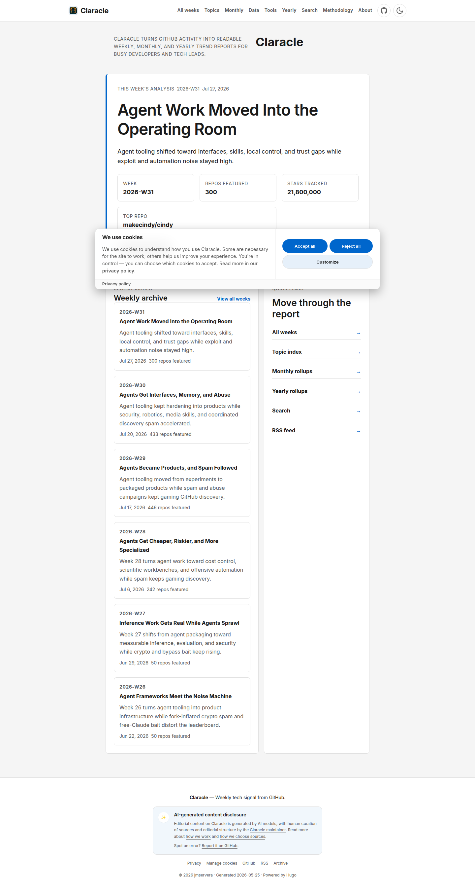
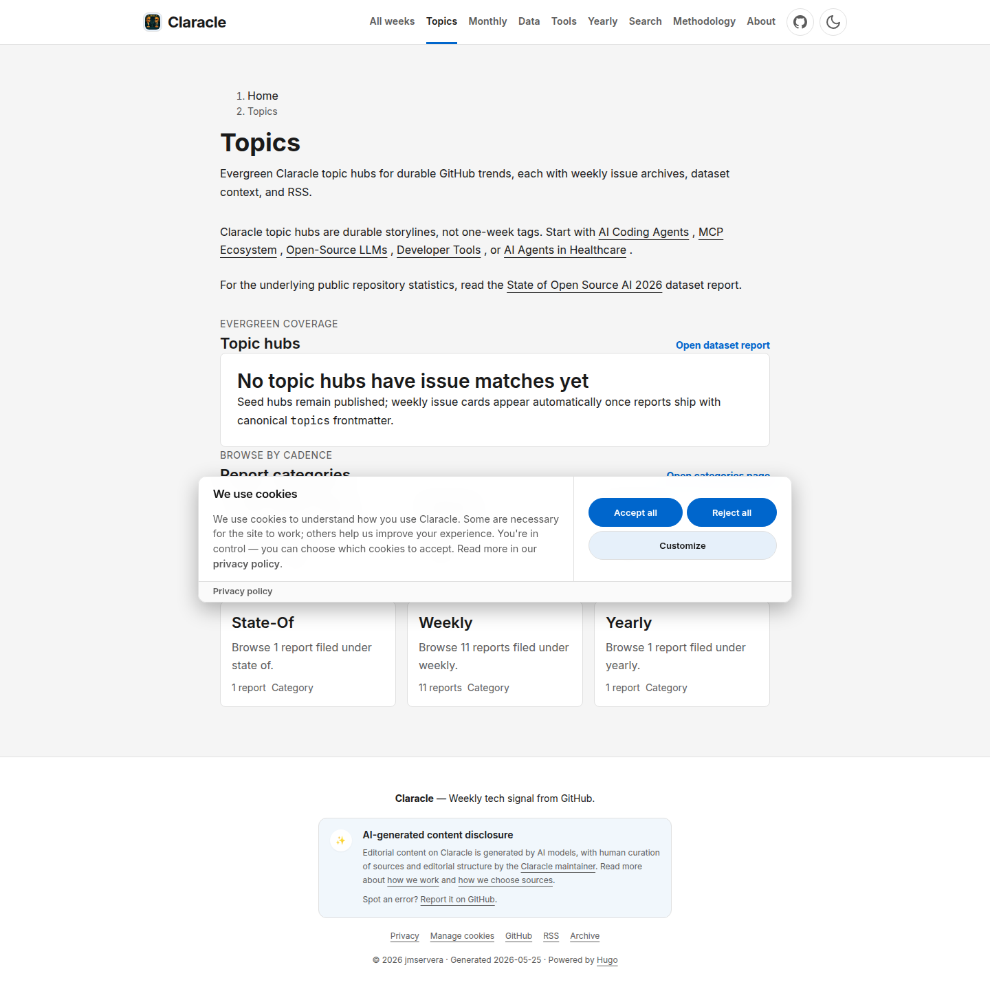
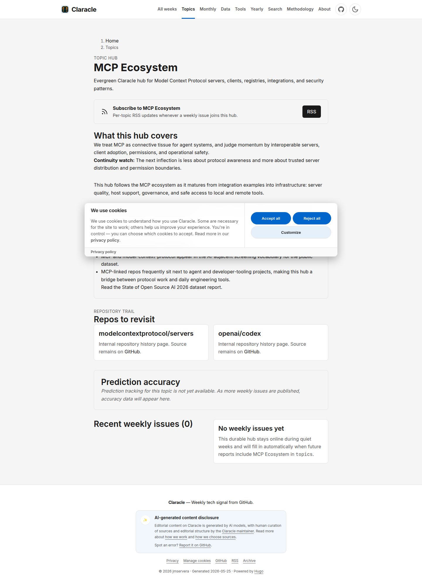
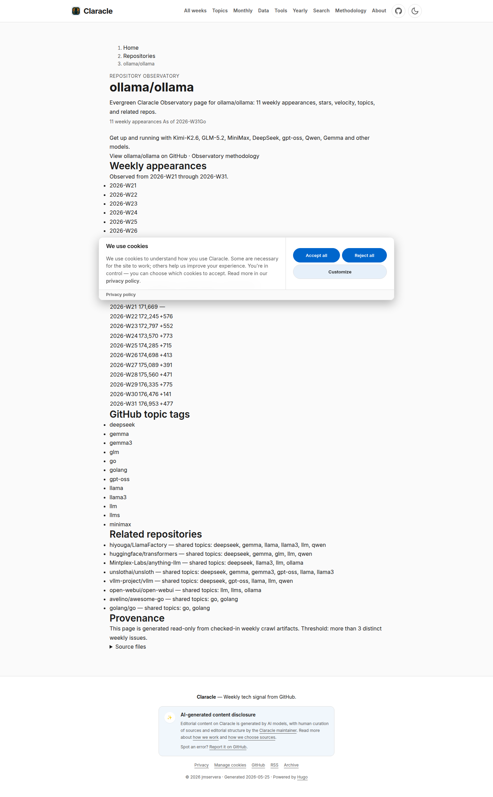
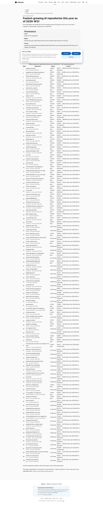
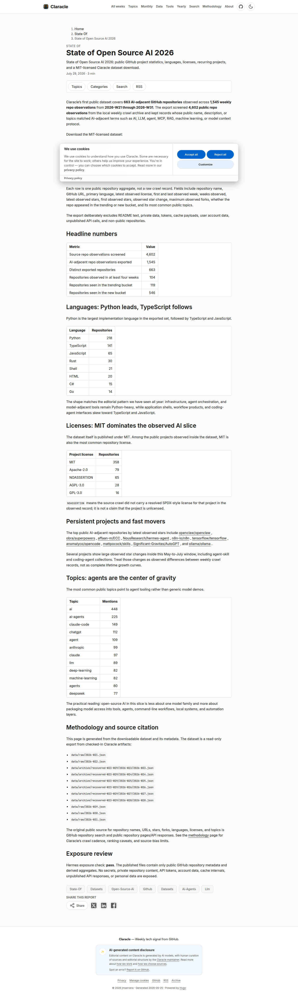
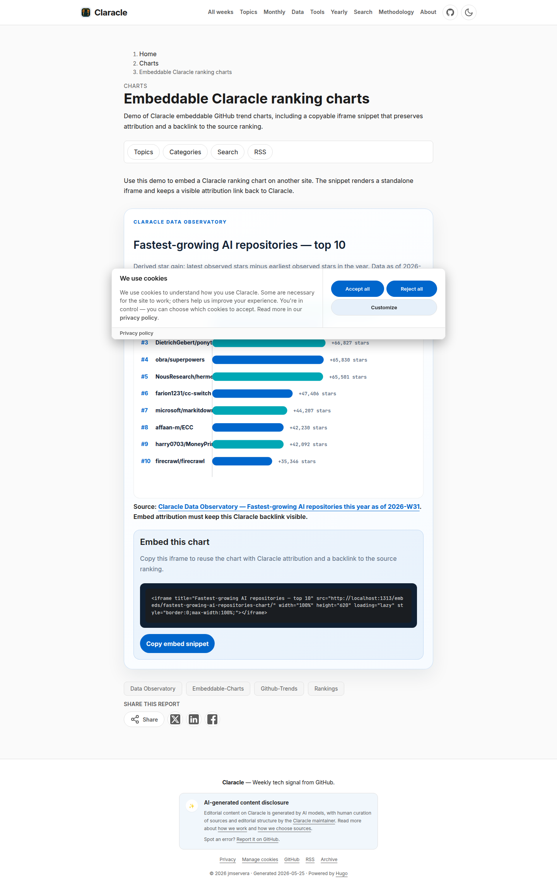
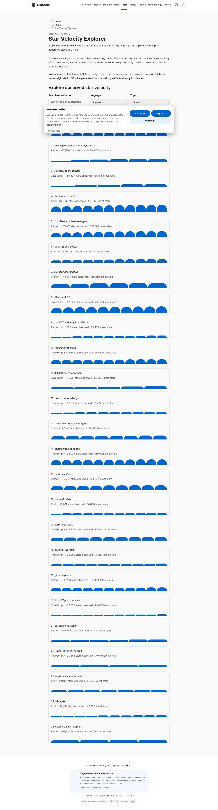
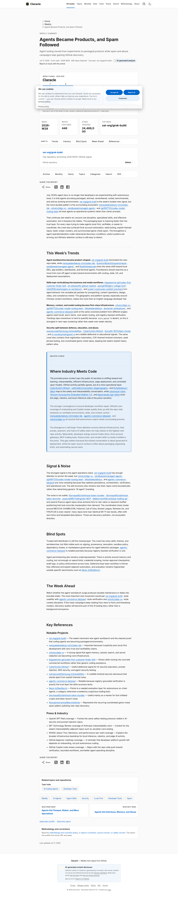
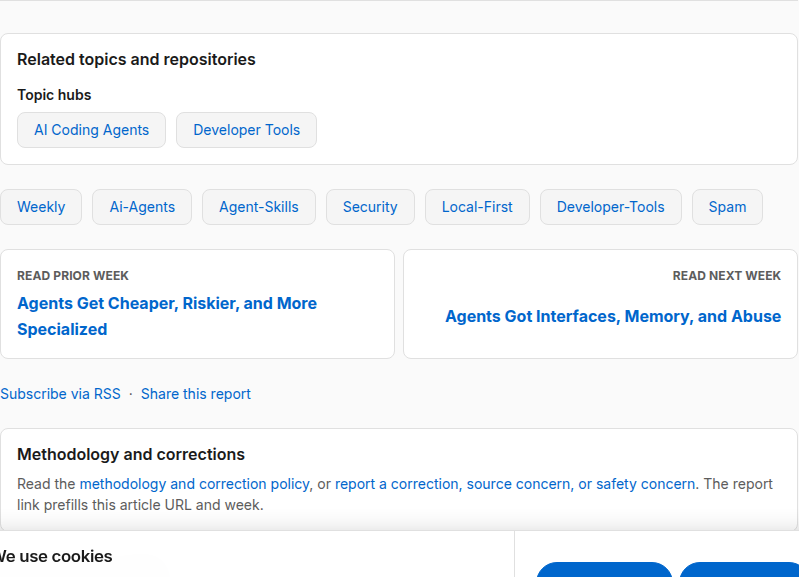

# Data Observatory Relaunch — Visual Acceptance Review

Epic: **#594** · Milestone: **Data Observatory Relaunch**

This gallery bundles rendered-site screenshots of every user-facing feature shipped in
the relaunch so reviewers can do a final **visual acceptance pass** in one place. All
shots were captured from a local `hugo --minify` build of `main` (baseURL rewritten to
`localhost` for capture only), with the analytics env vars set so the consent behavior
is exercised.

> Scope check for reviewers: confirm each page renders correctly, the internal links
> resolve to real hub/repo pages, titles/descriptions are unique (strict SEO gate), and
> nothing forks the weekly-fed taxonomy. Report anything off as a review comment on this PR.

## Delivered features

| # | Screenshot | Feature | Issue / PR | PRD |
|---|-----------|---------|-----------|-----|
| 1 | [Home](screenshots/01-home.png) | Landing page + cookie-consent banner (analytics stays disabled until consent) | #599 / #610, #620 | FR-035 |
| 2 | [Topics index](screenshots/02-topics-index.png) | Curated topic-hub index (editorial taxonomy, not forked) | #597 / #616 | FR-001/003/004 |
| 3 | [Topic hub — MCP Ecosystem](screenshots/03-topic-hub-mcp.png) | Per-topic hub page with dynamic lifecycle | #597 / #616 | FR-001/003/004 |
| 4 | [Repository page — ollama/ollama](screenshots/04-repo-ollama.png) | Per-repo trend-history page + lifecycle | #602 / #615 | FR-020/021/022 |
| 5 | [Data / trend page](screenshots/05-data-trend-page.png) | Fastest-growing AI repositories (data-driven page) | #601 / #613 | FR-010/011 |
| 6 | [State of Open Source AI 2026](screenshots/06-state-of-ai.png) | Annual "State of" page backed by the MIT-licensed dataset | #603 / #614 | FR-050/053 |
| 7 | [Embeddable charts](screenshots/07-embeddable-charts.png) | Copyable iframe embed + Claracle backlink | #604 / #617 | FR-051 |
| 8 | [Star Velocity Explorer](screenshots/08-star-velocity-tool.png) | Client-side interactive tool (no backend, same-origin data) | #605 / #618 | FR-052 |
| 9 | [Weekly article (full)](screenshots/09-weekly-article-internal-links.png) | Weekly report with internal-linking block | #600 / #619 | FR-040/041 |
| 10 | [Internal-linking block (detail)](screenshots/10-internal-linking-block.png) | "Related topics & repositories" + prev/next navigation | #600 / #619 | FR-040/041 |

## Cross-cutting evidence

- **On-page SEO metadata + structured data** (#598 / #611) — visible in every shot's
  title/description; enforced by the strict per-page uniqueness CI gate.
- **Internal link-check CI gate** (#600 / #619) — builds `public/` and fails on any
  broken internal link (verified: exit 1 on a deliberate broken link, exit 0 clean).
- **Dynamic file-based taxonomy registry** (#597) — `data/taxonomy/{topics,tags}.json`
  with per-term stats; repo GitHub topics feed the `tags` side (#602), curated `topics`
  stay editorial. Registry generation is byte-deterministic on re-run.
- **Analytics** (#599) — GA4 activates on deploy via the existing `GA_MEASUREMENT_ID`
  secret and is consent-gated; GSC becomes verifiable by adding a `GSC_SITE_VERIFICATION`
  secret (PR #620).

## Gallery

### 1. Home + consent banner

### 2. Topics index (curated hubs)

### 3. Topic hub — MCP Ecosystem

### 4. Repository page — ollama/ollama

### 5. Data / trend page

### 6. State of Open Source AI 2026

### 7. Embeddable charts

### 8. Star Velocity Explorer (client-side tool)

### 9. Weekly article (full page)

### 10. Internal-linking block (detail)

